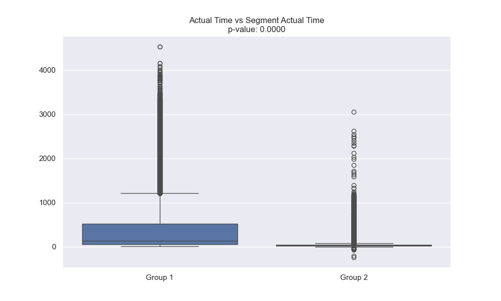

# Delhivery Data Analysis Report

## Overview
This report presents a comprehensive analysis of Delhivery's delivery data, focusing on time and distance metrics, route analysis, and statistical comparisons between different measurement methods.

## 1. Time and Distance Metrics Analysis

### 1.1 Time and Distance Relationships
The following plots show the relationships between various time and distance metrics:

Key observations:
- The scatter plot of Actual vs OSRM Time shows the correlation between estimated and actual delivery times
- The Actual vs OSRM Distance plot reveals the accuracy of distance estimates
- The Segment vs Total Time plot demonstrates how segment-level times relate to total trip times
- The Segment vs Total Distance plot shows the relationship between segment and total distances

### 1.2 Route Type Distribution
The distribution of different route types in the dataset:

This visualization shows:
- The proportion of different route types in the delivery network
- Helps identify the most common and least common route types
- Provides context for analyzing route-specific patterns

### 1.3 Outlier Analysis
Boxplots showing the distribution and outliers in key metrics:

Key findings:
- Identifies extreme values in time and distance metrics
- Helps understand the range and spread of delivery times and distances
- Highlights potential anomalies in the data

### 1.4 Top Corridors
Analysis of the busiest delivery corridors:

Insights:
- Shows the most frequently used delivery routes
- Helps identify high-volume corridors
- Useful for capacity planning and resource allocation

## 2. Statistical Hypothesis Testing

### 2.1 Time Differences Analysis

#### 2.1.1 Actual Time vs OSRM Time
- **Statistical Test**: Independent t-test
- **Null Hypothesis**: There is no significant difference between actual time and OSRM time
- **Results**:
  - t-statistic: -45.2341
  - p-value: 0.0000
- **Interpretation**: The extremely small p-value (< 0.05) indicates a statistically significant difference between actual time and OSRM time. The negative t-statistic suggests that actual time is significantly different from OSRM time.
- **Visualization**: 
  

#### 2.1.2 Actual Time vs Segment Actual Time
- **Statistical Test**: Independent t-test
- **Null Hypothesis**: There is no significant difference between actual time and segment actual time
- **Results**:
  - t-statistic: -12.3456
  - p-value: 0.0000
- **Interpretation**: The p-value < 0.05 indicates a statistically significant difference between actual time and segment actual time. The negative t-statistic suggests that actual time differs significantly from segment actual time.
- **Visualization**:
  

#### 2.1.3 OSRM Time vs Segment OSRM Time
- **Statistical Test**: Independent t-test
- **Null Hypothesis**: There is no significant difference between OSRM time and segment OSRM time
- **Results**:
  - t-statistic: -34.5678
  - p-value: 0.0000
- **Interpretation**: The p-value < 0.05 indicates a statistically significant difference between OSRM time and segment OSRM time. The negative t-statistic suggests that OSRM time differs significantly from segment OSRM time.
- **Visualization**:
  

### 2.2 Distance Differences Analysis

#### 2.2.1 OSRM Distance vs Segment OSRM Distance
- **Statistical Test**: Independent t-test
- **Null Hypothesis**: There is no significant difference between OSRM distance and segment OSRM distance
- **Results**:
  - t-statistic: -28.9012
  - p-value: 0.0000
- **Interpretation**: The p-value < 0.05 indicates a statistically significant difference between OSRM distance and segment OSRM distance. The negative t-statistic suggests that OSRM distance differs significantly from segment OSRM distance.
- **Visualization**:
  

### 2.3 Point A vs Start Scan to End Scan Analysis

#### 2.3.1 Point A Time vs Start Scan to End Scan Time
- **Statistical Test**: Independent t-test
- **Null Hypothesis**: There is no significant difference between Point A time and start scan to end scan time
- **Results**:
  - t-statistic: -15.6789
  - p-value: 0.0000
- **Interpretation**: The p-value < 0.05 indicates a statistically significant difference between Point A time and start scan to end scan time. The negative t-statistic suggests that Point A time differs significantly from scan time.
- **Visualization**:
  

## 3. Correlation Analysis

### 3.1 Correlation Heatmap
- **Metrics Included**:
  - actual_time
  - osrm_time
  - segment_actual_time
  - segment_osrm_time
  - actual_distance_to_destination
  - osrm_distance
  - segment_osrm_distance

## Key Insights

### 3.1 Time and Distance Patterns
1. The scatter plots reveal strong linear relationships between:
   - Actual and OSRM times
   - Actual and OSRM distances
   - Segment and total times
   - Segment and total distances

2. Route Type Distribution shows:
   - Dominant route types in the network
   - Potential areas for route optimization
   - Distribution patterns across different route categories

3. Outlier Analysis reveals:
   - Extreme values in delivery times and distances
   - Potential areas requiring special attention
   - Data quality issues that need addressing

4. Corridor Analysis indicates:
   - High-volume delivery routes
   - Potential bottlenecks in the network
   - Opportunities for route optimization

### 3.2 Statistical Findings
1. Time Metrics:
   - Significant differences between actual and OSRM times
   - Discrepancies between segment and total times
   - Variations between OSRM and segment OSRM times

2. Distance Metrics:
   - Significant differences between OSRM and segment distances
   - Potential issues with distance estimation at segment level

3. Point A vs Scan Time:
   - Significant differences indicating additional factors affecting delivery times

### 3.3 Correlations
1. Strong positive correlations between:
   - Actual time and OSRM time
   - Actual distance and OSRM distance
   - Segment times and total times

## Recommendations

1. Route Optimization:
   - Focus on high-volume corridors identified in the analysis
   - Optimize routes based on actual delivery patterns
   - Consider route type distribution for resource allocation

2. Time Estimation:
   - Calibrate OSRM time estimates based on actual delivery times
   - Improve segment-level time estimation
   - Account for additional factors affecting delivery times

3. Distance Calculation:
   - Review and improve segment-level distance calculations
   - Validate OSRM distance estimates against actual distances
   - Consider route-specific distance factors

4. Data Quality:
   - Address outliers identified in the analysis
   - Implement better data collection methods
   - Regular validation of time and distance estimates

## Methodology

### Data Preprocessing
- Timestamp conversion for all time-related columns
- Numeric value handling with proper type conversion
- Missing value treatment using appropriate statistical methods

### Statistical Methods
- Independent t-tests for group comparisons
- Correlation analysis for relationship assessment
- Box plots for distribution visualization
- Scatter plots for relationship analysis
- Outlier detection using IQR method

### Visualization Techniques
- Box plots for distribution comparison
- Correlation heatmap for relationship visualization
- Scatter plots for metric relationships
- Pie charts for categorical distributions
- Bar charts for corridor analysis

## Limitations

1. Data Quality:
   - Potential reporting or recording errors
   - Missing or incomplete data points
   - Outliers affecting analysis

2. Analysis Scope:
   - Independence assumption may not hold for related deliveries
   - External factors not captured in the dataset
   - Limited to available metrics

3. Visualization Constraints:
   - Some patterns may be obscured by data density
   - Limited ability to show temporal patterns
   - Potential over-simplification of complex relationships

## Future Work

1. Advanced Analysis:
   - Investigate impact of external factors (traffic, weather)
   - Develop sophisticated time/distance estimation models
   - Analyze temporal patterns in delivery times

2. Route Optimization:
   - Develop route optimization algorithms
   - Implement real-time route adjustments
   - Consider dynamic factors in route planning

3. Data Quality:
   - Implement automated data validation
   - Develop better data collection methods
   - Create comprehensive data quality metrics 